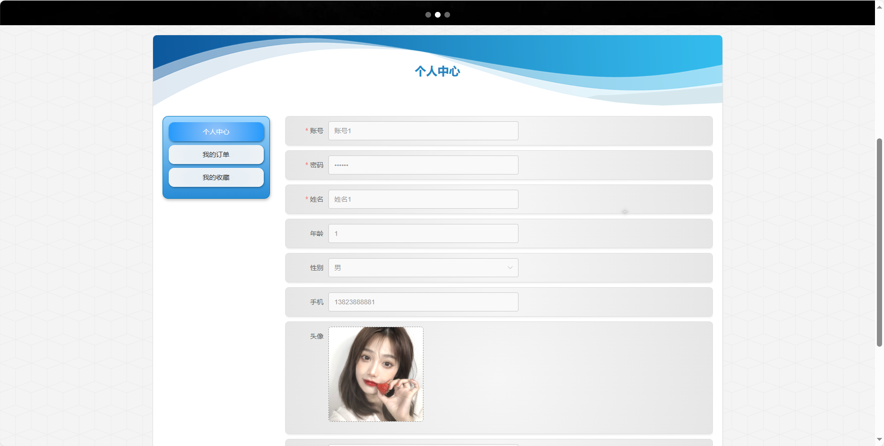
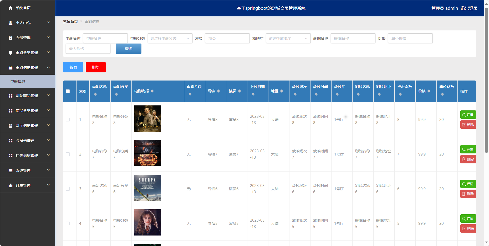

基于Springboot的影城会员管理系统
=
### 完整代码获取地址：从戎源码网 ([https://armycodes.com/](https://armycodes.com/))
### 作者微信：19941326836  QQ：952045282 
### 承接计算机毕业设计、Java毕业设计、Python毕业设计、深度学习、机器学习
### 选题+开题报告+任务书+程序定制+安装调试+论文+答辩ppt 一条龙服务
### 所有选题地址https://github.com/nature924/allProject

一、项目介绍
---
基于Spring Boot框架实现的影城会员管理系统，系统包含两种角色：管理员、用户，系统分主要功能如下。
### 【用户功能】
1. 首页：展示影城。
2. 电影信息：列出当前热映电影和电影详情。
3. 影院商品：查看和购买影城商品，如爆米花、饮料等。
4. 通知公告：浏览影城发布的通知和公告信息。
5. 会员中心：用户个人信息管理，包括查看会员卡信息、挂失处理等。
### 【后台管理功能】
1. 系统首页：后台管理的主页，显示关键统计信息。
2. 个人中心：管理员个人信息管理，。
3. 会员卡管理：管理会员卡的信息，包括办理、续费、注销等。
4. 挂失信息管理：处理会员卡挂失申请，记录挂失信息。
5. 在线咨询：提供在线咨询服务，处理用户咨询和问题。
6. 个人中心：管理员个人信息管理，包括修改密码和查看个人信息。

### 【管理员功能】
1. 系统首页：管理员后台的主页。
2. 个人中心：管理员个人信息管理，。
3. 会员管理：添加、编辑、删除会员信息，查看会员卡使用情况。
4. 电影分类管理：管理电影的分类信息。
5. 电影信息管理：添加、编辑、删除电影信息。
6. 影院商品管理：管理影城商品的信息，商品上下架、价格调整等。
7. 商品分类管理：管理商品的分类信息。
8. 影厅信息管理：管理影厅的信息，。
9. 会员卡管理：管理会员卡的信息，办理、续费、注销等。
10. 挂失信息管理：处理会员卡挂失申请，记录挂失信息。
11. 系统管理：管理系统参数，如通知公告、商品库存阈值等。
12. 订单管理：查看和管理用户购买电影票和商品的订单信息。

二、项目技术
---
- 编程语言：Java
- 数据库：MySQL
- 项目管理工具：Maven
- 前端技术：VUE、HTML、Jquery、Bootstrap
- 后端技术：Spring、SpringMVC、MyBatis

三、运行环境
---
- 操作系统：Windows、macOS都可以
- JDK版本：JDK1.8以上都可以
- 开发工具：IDEA、Ecplise、Myecplise都可以
- 数据库: MySQL5.7以上都可以
- Tomcat：任意版本都可以
- Maven：任意版本都可以

四、运行截图
---

### 程序截图：

